# Visitor Experience Platform — Architecture & Technical Design

| | |
|---|---|
| **System** | Innovation City Visitor Experience (kiosk + live dashboard) |
| **Repos analysed** | `inc-kiosk-frontend` (Next.js 14), `inc-live-dashboard` (FastAPI) |
| **Companion docs** | *Visitor Identification & Real-Time Tracking Hardware Plan v1.1*, *Heatmap Camera & Kiosk System Plan* |
| **Document date** | 29 Sep 2026 |
| **Basis** | Static review of the code in this workspace (29 Sep 2026). Nothing was run, so runtime behaviour is inferred from the source. |
| **Updated** | 3 Oct 2026: face vectors moved from Qdrant to pgvector; room booking moved to Spacebring (sandbox) with a Postgres mirror. |

---

## 1. Purpose and scope

A visitor arrives at Innovation City. The system should:

1. **Detect** them at the entrance and **identify** them by face.
2. If they are **known**, greet them, load their history and bookings, and route them to a service.
3. If they are **unknown**, search the public web for candidate matches and show the **top 3** for the visitor to confirm ("Is this you?").
4. If none match, **register** the visitor. Voice agent and face recognition work together to collect their details, capture consent and enrol their face.
5. Route the visitor to a service (meeting room, podcast studio, TikTok studio, event, business centre, other) and record everything for the live dashboard.

### 1.1 Built today vs. target design

This document separates what exists in the code from what the hardware plan describes but nobody has built yet. The difference matters for planning.

| Capability | Status | Where |
|---|---|---|
| Kiosk UI with browser camera capture and auto face-scan | **Built** | `inc-kiosk-frontend/app/page.tsx` |
| Face detection, embedding and 1:N match (InsightFace + pgvector) | **Built** | `face_recognition_service.py` |
| Unknown-face capture and FaceCheck.ID top-3 web search | **Built, but see finding F-1** | `face_unknown_capture.py`, `face_web_search.py` |
| Registration, consent, face enrolment | **Built** | `routers/kiosk_flow.py` |
| Voice agent (OpenAI Realtime, tool-calling) | **Built** | `VoiceAssistant.tsx`, `voice_agent/realtime_auth.py` |
| Event selection, other assistance | **Built** | `routers/kiosk_flow.py` |
| Room booking through Spacebring (availability, create, move, cancel) with a Postgres mirror and a 60 s sync back | **Built** (Spacebring sandbox; meeting rooms stay local) | `spacebring_*.py`, `routers/kiosk_flow.py` |
| Admin review of unknown captures | **Built** (API only) | `routers/face.py` |
| Read-only TV dashboard data (zones, events, metrics) | **Built** (API only, no UI) | `routers/kiosk.py` |
| **Entrance camera (RTSP) → recognition consumer** | **Not built** | Only a webcam prototype: `scripts/live_camera_worker.py` |
| **Separate confirmation screen (screen 2) + dedicated mic** | **Not built** | Plan only. Today one kiosk does both jobs. |
| **Real-time floor tracking (live dot on floor plan)** | **Not built** | Plan only. Hardware plan §7 |
| **Live floor-plan dashboard UI** | **Not built** | Hardware plan §9 confirms this |

---

## 2. System context

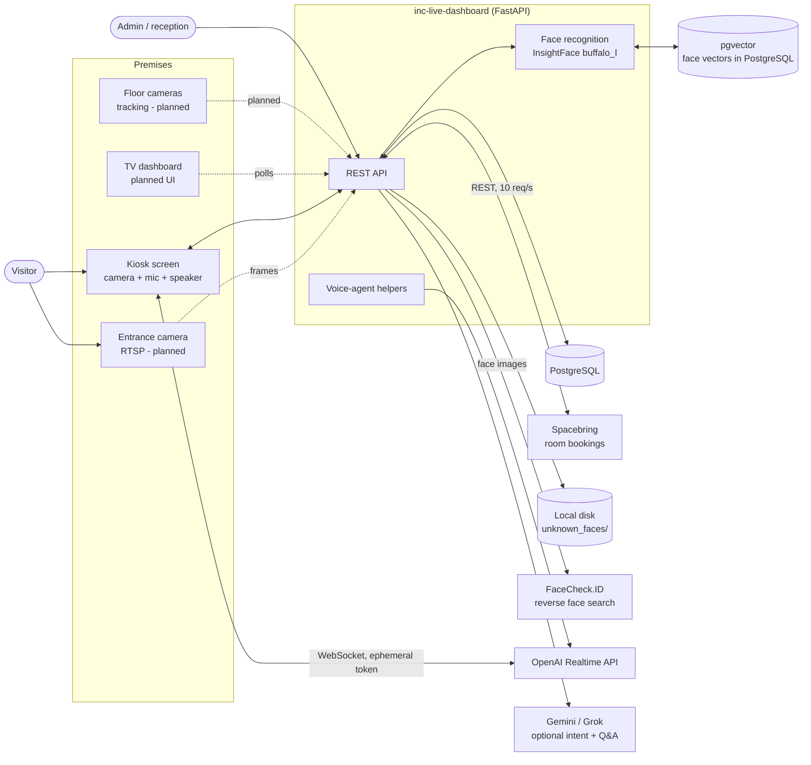

Solid lines exist in the code. Dotted lines are planned.

---

## 3. Components

### 3.1 Kiosk frontend — `inc-kiosk-frontend`

- **Stack:** Next.js 14 (App Router), React 18, Tailwind, Zod, `@openai/agents` for the realtime voice session, Vitest.
- **Shape:** a single client page (`app/page.tsx`, about 1,700 lines) driven by a step state machine (`lib/flow.ts`).
- **State machine steps:** `start → face-scan → (welcome-back | profile-lookup → register → facial-consent → scan-progress) → service-selection → booking | booking-podcast | booking-tiktok | events | center | other → thank-you`.
- **Camera:** `getUserMedia({ video: { facingMode: "user" } })` gives a live preview. `captureFaceSamples(n)` grabs several JPEG frames as base64.
- **API client:** `lib/api.ts` (`requestJson`). It unwraps the backend envelope `{success, message, data, error_code}` and throws a typed `ApiRequestError`. The base URL comes from `NEXT_PUBLIC_API_BASE_URL` and defaults to `http://127.0.0.1:8000`.
- **Voice UI:** `components/kiosk/VoiceAssistant.tsx`. It opens automatically after a successful recognition and can be reopened from the UI. The realtime agent's tools call back into `page.tsx` handlers so the on-screen form and the conversation stay in sync.

### 3.2 Backend — `inc-live-dashboard`

- **Stack:** FastAPI, SQLAlchemy 2, psycopg 3, pydantic-settings, httpx.
- **Face stack:** InsightFace `buffalo_l` (detection + recognition only) on ONNX Runtime **CPU**, 320×320 detection size, 512-d embeddings stored in PostgreSQL with pgvector (`face_vectors` table, cosine distance, HNSW index).
- **Startup:** optional `create_all` and seeding, plus a background thread that warms the face model so the first scan is not slow.

| Module | Responsibility |
|---|---|
| `routers/kiosk_flow.py` (`/api/kiosk/*`) | Whole visitor journey: recognise, look up, register, consent, enrol, session, booking, events, assistance |
| `routers/face.py` (`/api/face/*`) | Admin review of unknown captures: detect, list, link, dismiss, re-run web search, recognition events |
| `routers/kiosk.py` (`/api/*`) | **Read-only** TV dashboard data: header, zones, activity metrics, events, bookings, feed |
| `face_recognition_service.py` | Detect, embed, match, enrol. Match threshold **0.60** |
| `face_unknown_capture.py` | Save unknown face, embed it, call web search, persist matches |
| `face_web_search.py` | FaceCheck.ID client: upload, search, poll, parse top 3 |
| `face_gallery.py` | Legacy Postgres-backed embedding store (bulk import path) |
| `voice_agent/realtime_auth.py` (`/voice-agent/*`) | Mints OpenAI ephemeral token; serves `knowledge_base.md` |
| `room_question_service.py`, `booking_intent_service.py`, `registration_intent_service.py` | Transcript → structured intent / room answers, scripted by default, Gemini or Grok optional |
| `voice_agent/tts_service.py`, `transcription_service.py`, `xai_client.py`, `gemini_service.py` | Text pipeline helpers (server TTS / STT / LLM clients) |
| `admin.py` | Back-office CRUD (about 1,400 lines); login moved to `admin_panel/` |
| `admin_panel/` | Admin panel backend: signed-cookie sessions, roles (`permissions.py`), the gate every `/admin/*` and `/api/face/*` route passes (`deps.admin_gate`), audit log (`audit.py`), approval queue, dashboard, admin users |

### 3.3 External services

| Service | Used for | When |
|---|---|---|
| **FaceCheck.ID** | Reverse face search on the public web (top 3 candidates) | Face scored below threshold and `FACE_WEB_SEARCH_ENABLED=true` |
| **OpenAI Realtime API** | Live voice conversation (model `gpt-realtime-2.1`, voice `marin`) | Voice assistant open. The browser connects directly. |
| **Gemini / Grok (xAI)** | Optional intent parsing and room Q&A | `ROOM_QUESTION_PROVIDER` is `gemini` or `grok`. Otherwise a scripted matcher runs. |
| Open-Meteo weather API | Weather chip on the kiosk header | Frontend only (`page.tsx`) |

---

## 4. Data architecture

### 4.1 Stores

| Store | Holds | Notes |
|---|---|---|
| **PostgreSQL** | Visitors, bookings, events, zones, visit sessions, activity, consent, unknown captures, web matches, recognition events | System of record |
| **PostgreSQL + pgvector** | `face_vectors`: 512-d normalised face embeddings, `face_identifier` (`visitor:<id>`), `photo_base64` thumbnail (≤200k chars) | Live matching index, in the same database as everything else |
| **Spacebring** | Room bookings (system of record), rooms, availability | Postgres `bookings` is a mirror, kept in step by the kiosk and a 60 s sync |
| **Local disk** | `data/unknown_faces/unknown_*.jpg` | Raw images of unrecognised people |
| **In-memory** | `voice_agent/session_manager.py` session dict | Lost on restart, single-process only |

### 4.2 Key tables (from the migrations)

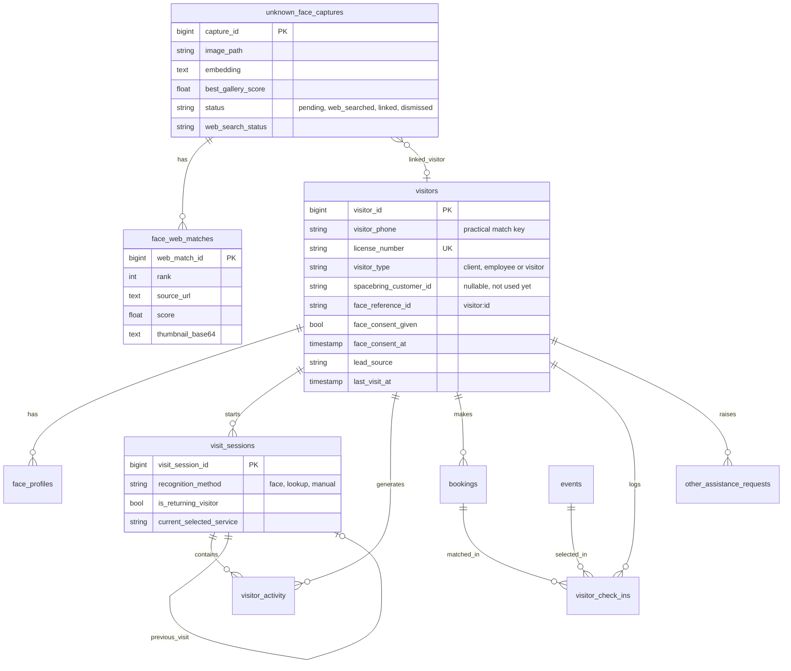

**Identity link:** a face in `face_vectors` is stored under the identifier `visitor:<visitor_id>`. Recognition returns that name and the backend resolves it back to a `visitors` row (`find_visitor_by_face_name`).

**Match keys:** face (pgvector), phone number (primary fallback) and licence number.

---

## 5. Flow-by-flow

### Flow 0 — Entrance detection *(target; only prototyped)*

**Intent:** a camera at the door notices someone arriving before they reach the kiosk.

**Today:** there is no entrance ingestion. `scripts/live_camera_worker.py` is a standalone webcam loop. It detects a stable face, matches it, and writes `RecognitionEvent` rows. It has no UI and no web-search step.

**Target (Hardware Plan §5, §9):**

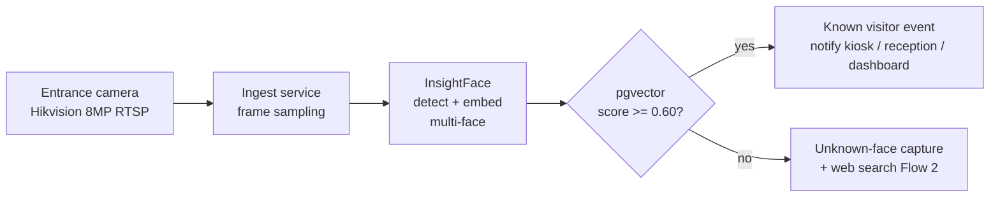

**To build:** an RTSP consumer, a dedup/debounce layer so one person does not fire 50 events, and an event channel to the kiosk (WebSocket or SSE, since the kiosk currently only polls or acts on user input).

---

### Flow 1 — Kiosk face scan and recognition *(built)*

**Trigger:** kiosk `start` screen → automatic scan after a short settle delay.

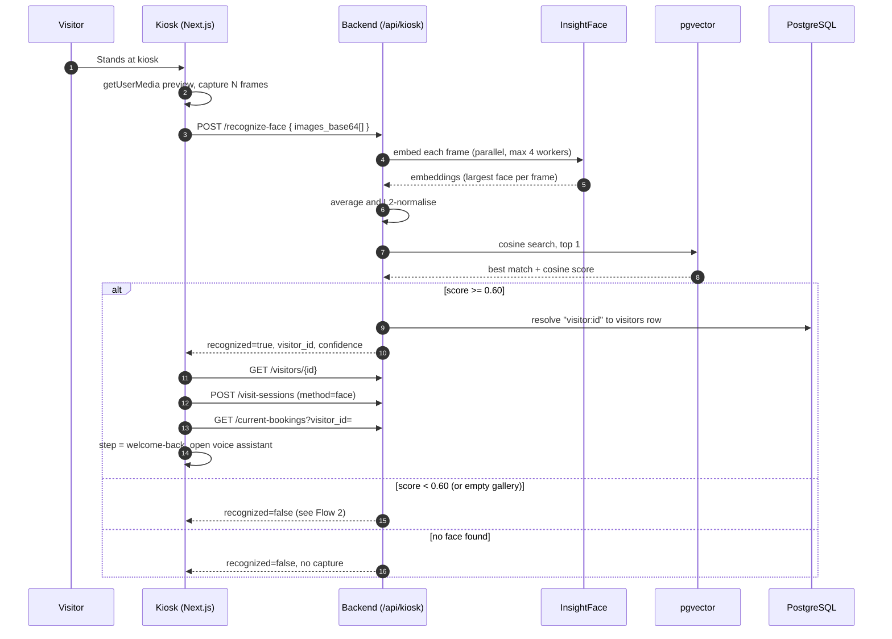

**Decision rule:** one global threshold, `MATCH_THRESHOLD = 0.60`. There is no "maybe" band.

**Returning visitor logic:** `POST /visit-sessions` looks up the previous visit. It sets `is_returning_visitor` and `previous_visit_id`, updates `visitors.last_visit_at`, and writes a `returning_visit` activity row that quotes the last visit's purpose and notes.

**Errors:** the failure codes are `FACE_RECOGNITION_UNAVAILABLE` (503), `FACE_IMAGE_INVALID` (400) and `FACE_RECOGNITION_FAILED` (500). The UI falls back to phone lookup.

**Test hook:** `simulate_mobile_number` bypasses the camera. The frontend's "Face Recognized (Temp)" button uses `+971501234567`.

---

### Flow 2 — Unknown visitor: web search and "Is this you?" *(built; blocked by F-1)*

**Trigger:** Flow 1 returns `not_registered`.

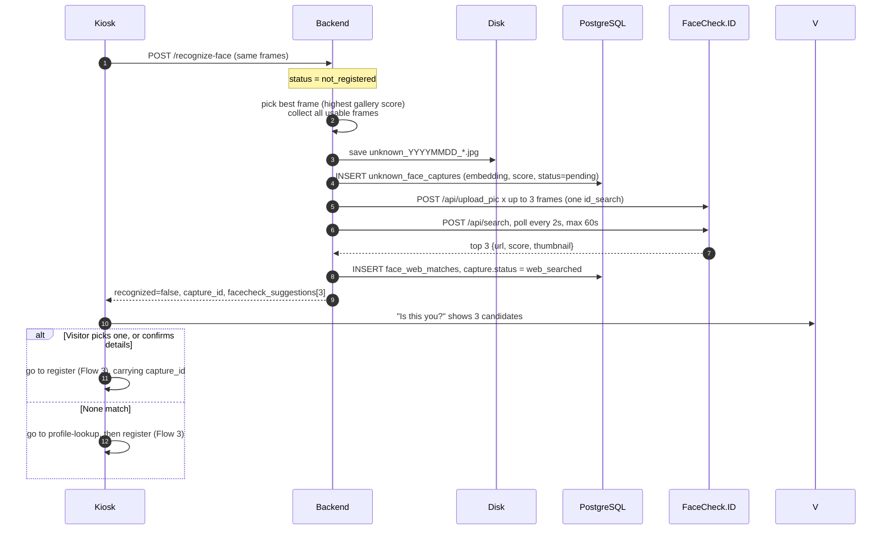

**Design notes**
- Web search is **optional and fail-open**. If it is disabled, has no token, times out or errors, `web_search_status` records why and the visitor goes straight to registration.
- Up to `FACE_WEB_SEARCH_MAX_IMAGES` (default 3) frames go into one search bucket. This is documented as no extra credit cost.
- `FACE_WEB_SEARCH_TESTING_MODE=true` uses FaceCheck.ID's demo mode. It is free but inaccurate.
- A confirmed web match is **a lead for a human or the visitor, not an identity**. The system never auto-registers from a web hit.

---

### Flow 3 — Registration, consent and face enrolment *(built)*

Two paths reach registration. Both end with the face stored in pgvector under `visitor:<id>` and a `welcome-back` session.

**Path A — from Flow 2 (capture exists).** One step enrols the face.

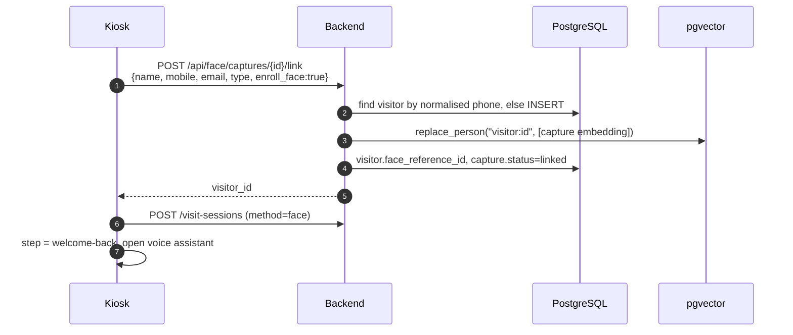

**Path B — no capture (web search off or skipped).**

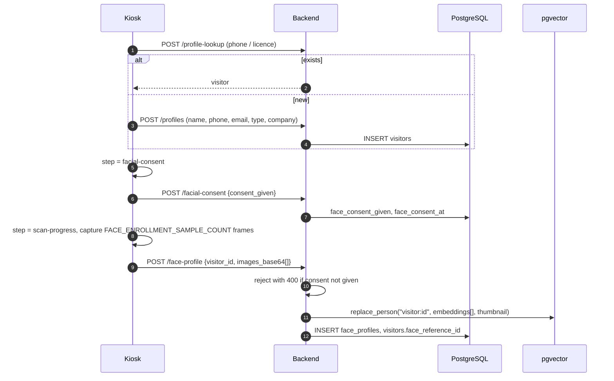

**Rules enforced in code**
- `/face-profile` returns `FACIAL_CONSENT_REQUIRED` unless `face_consent_given` is true.
- Re-enrolling **replaces** the person's vectors (delete by identifier, then insert). It does not accumulate.
- `visitor_type` is `client`, `employee` or `visitor` (DB check constraint). Companies carry `company_name` and `company_number`.

---

### Flow 4 — Voice agent *(built)*

**Architecture:** the voice session runs **in the browser**, not on the server. The backend only mints a short-lived credential and serves the knowledge base.

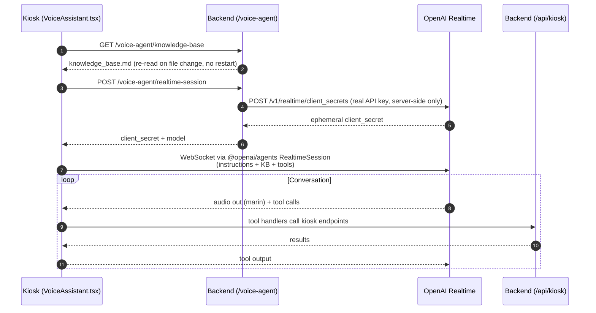

**Tools the agent can call** (reference implementation in `real_agent_tester/src/main.js`; the production copy is in `VoiceAssistant.tsx`):

| Tool | Effect |
|---|---|
| `lookup_visitor` | `GET /visitor-by-phone`. Phone-only, because voice-transcribed names are unreliable. |
| `register_visitor` | `POST /profiles`, then triggers face enrolment through `handleVoiceFaceEnrollment` |
| `capture_registration_field` | Fills the on-screen form live as the visitor speaks, and navigates to `register` if needed |
| `check_availability` | `GET /availability` (asks Spacebring) |
| `create_booking` | `POST /bookings` (room, time, duration). Needs on-screen approval. |
| `list_my_bookings` | `GET /current-bookings` |
| `reschedule_booking` | `PATCH /bookings/{id}`. Needs on-screen approval. |
| `cancel_booking` | `DELETE /bookings/{id}`. Needs on-screen approval. |
| `preview_room` | Shows the room's image and details on screen |
| `end_conversation` | Closes the session |

**How voice and face work together**
- **Known visitor:** face recognition selects the visitor, and the voice agent opens already knowing who they are ("welcome back").
- **Unknown visitor:** the agent collects name, phone, email and type by conversation. The form fills live. `register_visitor` creates the profile, then the kiosk captures face samples to enrol. The conversation continues without redirecting the visitor.
- **Knowledge:** answers come from `knowledge_base.md` (editable by non-engineers). Live room status always comes from the `zones` table via `zones_with_status()`, never invented.

**Alternate text pipeline** (server-side, optional): audio → `transcription_service` (OpenRouter or xAI) → `room_question_service` / intent services (Gemini or Grok, scripted fallback) → `tts_service` (xAI streaming or OpenRouter). The frontend falls back to browser speech synthesis when server TTS is off.

---

### Flow 5 — Service selection and fulfilment *(built)*

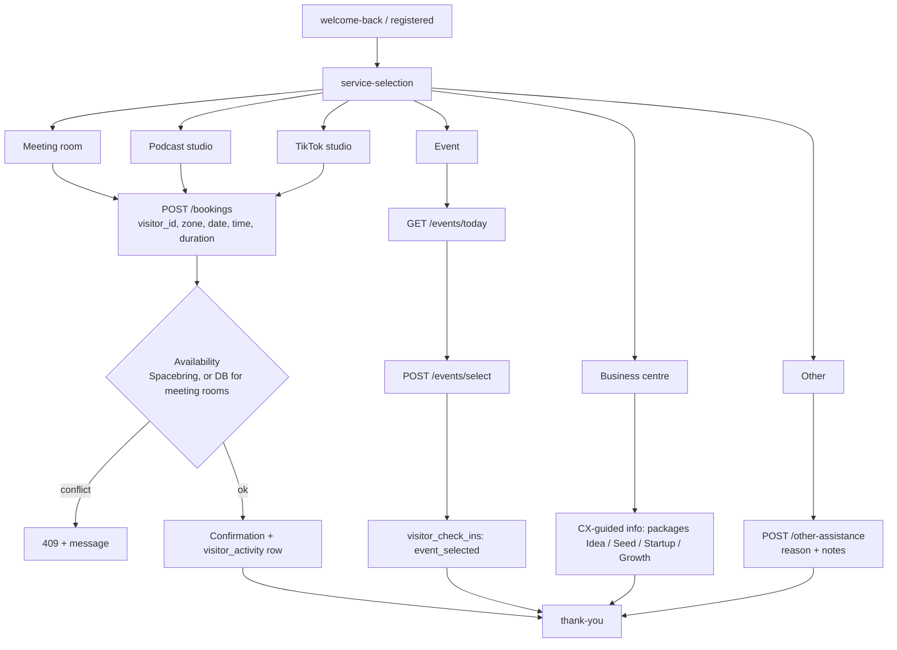

- **Existing bookings:** `/current-bookings` finds the visitor's live and upcoming bookings so a person with a reservation is routed straight to it.
- **Overlaps:** for rooms linked to Spacebring (the podcast room and five TikTok rooms), Spacebring decides availability and the API returns `409` when the slot is taken. Meeting rooms are not in Spacebring yet and still use the local overlap check. If Spacebring is down the API returns `502 SPACEBRING_UNAVAILABLE` and does not book locally.
- **Spacebring flow:** check availability, create the booking, write the Postgres mirror row (undo the Spacebring booking if that write fails). Bookings are anonymous (unowned) until customer matching is decided, so no credits are used. `PATCH` and `DELETE /bookings/{id}` move and cancel through Spacebring first.
- **Sync:** `spacebring_sync.py` runs every 60 s (`SPACEBRING_SYNC_INTERVAL_SECONDS`) and mirrors bookings made, moved or cancelled directly in Spacebring. It reads Spacebring fully before changing anything, ignores bookings younger than 60 s, and never touches rows without a Spacebring ID.
- **Operating hours:** `operating_hours.py` supplies open and close times for booking validation.
- **Audit trail:** every step writes `visitor_activity` and `visitor_check_ins` (`match_method`: `phone`, `license_number` or `face`).

---

### Flow 6 — Admin review of unknown captures *(built; UI in `inc-kiosk-frontend-admin`)*

For faces that were not resolved at the kiosk.

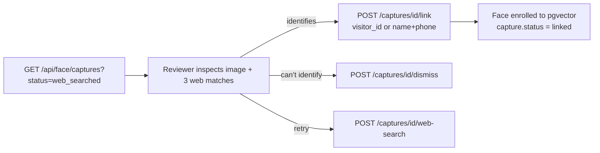

`GET /api/face/recognition-events` exposes the recognition log for audit.

**Admin access.** Every `/admin/*` and `/api/face/*` route requires a signed-in admin user (HTTP-only cookie, server-side session, scrypt password hashes, login rate limit) and a role that allows the action; anonymous calls return 401 and a wrong role 403. Roles: `super_user`, `reception`, `reviewer`, `read_only`. Only `reviewer` and `super_user` see FaceCheck.ID source links and thumbnails. Every admin write lands in `admin_audit_log`. Users are created with `scripts/create_admin_user.py`.

**Pending visitors.** A new person registered at the kiosk (`POST /api/kiosk/profiles` or `POST /api/kiosk/captures/{id}/link`) is created with `approval_status = 'pending'` and a `visitor_approvals` row. Pending visitors can finish today's visit but are not found by phone, licence or face lookups, and no face is stored. A reviewer approves (face saved, with consent recorded) or rejects (face data and scan image removed) in the admin panel.

---

### Flow 7 — TV dashboard data *(API built, UI not built)*

`routers/kiosk.py` exposes read-only endpoints: `/api/header`, `/zones`, `/activity-metrics`, `/ecosystem-metrics`, `/events`, `/bookings` and `/activity-feed`. Booking and event status (`live`, `upcoming`, `ended`) is computed from database time. Screens 1 and 2 can also create bookings through `/api/screen/bookings`.

The live floor-plan view (real-time visitor dots) needs the tracking service in Flow 8 and a new frontend. Neither exists yet.

---

### Flow 8 — Indoor real-time tracking *(target)*

From Hardware Plan §7 and §9. Not started.

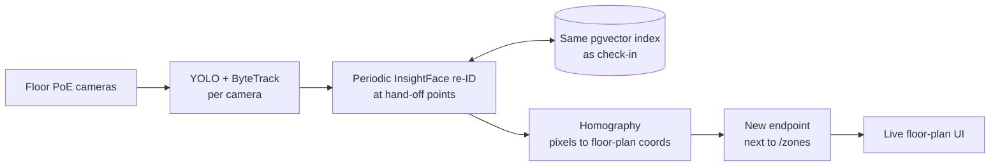

The plan disqualifies V-Count for this (it outputs aggregate counts, never coordinates). Xovis is only viable after a written RFI. The in-house build is the recommended primary path.

---

## 6. API catalogue (kiosk journey)

All responses use the envelope `{ success, message, data }` or `{ success:false, message, error_code, details }`.

| Method | Path | Purpose |
|---|---|---|
| POST | `/api/kiosk/recognize-face` | Match frames, or create capture and web search |
| GET | `/api/kiosk/visitor-by-phone` | Phone lookup (used by voice agent) |
| POST | `/api/kiosk/profile-lookup`, `/license-lookup` | Manual identity lookup |
| POST | `/api/kiosk/profiles` | Create visitor |
| POST | `/api/kiosk/facial-consent` | Record consent and timestamp |
| POST | `/api/kiosk/face-profile` | Enrol face (consent-gated) |
| GET | `/api/kiosk/visitors/{id}` | Visitor detail |
| POST | `/api/kiosk/visit-sessions` | Start visit, compute returning status |
| GET | `/api/kiosk/current-booking(s)` | Visitor's live and upcoming bookings |
| POST | `/api/kiosk/bookings` | Create booking (Spacebring first, Postgres mirror) |
| PATCH/DELETE | `/api/kiosk/bookings/{id}` | Reschedule or cancel a booking |
| GET | `/api/kiosk/availability` | Is a room free for a date, time and duration |
| GET/POST | `/api/kiosk/events/today`, `/events/select` | Event flow |
| POST | `/api/kiosk/other-assistance` | Free-form help request |
| POST | `/api/kiosk/room-question`, `/speak` | Text-pipeline Q&A and TTS |
| POST | `/api/kiosk/parse-booking-intent`, `/parse-registration-intent` | Transcript to structured fields |
| POST | `/api/face/detect` | Admin/test detection |
| GET/POST | `/api/face/captures[...]` | List, view, link, dismiss, re-search |
| POST | `/voice-agent/realtime-session` | Mint ephemeral voice token |
| GET | `/voice-agent/knowledge-base` | Serve KB |
| GET | `/health`, `/health/db` | Health checks |

---

## 7. Configuration

| Variable | Default | Effect |
|---|---|---|
| `DATABASE_URL` | local Postgres | System of record |
| `AUTO_CREATE_TABLES` / `SEED_SAMPLE_DATA` | `false` in code (`.env.example` sets `true`) | Dev convenience, turn off in production |
| `ADMIN_SESSION_SECRET` | empty | Signs admin session cookies (32+ chars). Required when `ENVIRONMENT=production`; the API refuses to start without it |
| `ADMIN_SESSION_TTL_MINUTES`, `ADMIN_COOKIE_SECURE`, `ADMIN_LOGIN_MAX_ATTEMPTS`, `ADMIN_LOGIN_WINDOW_SECONDS` | `480`, `false`, `5`, `900` | Session length, HTTPS-only cookie, login rate limit |
| `CORS_ALLOWED_ORIGINS` | local dev origins | Comma-separated origins allowed with cookies (no `null`) |
| `SPACEBRING_ENVIRONMENT` | `sandbox` | Label shown in the admin panel (`sandbox` or `live`) |
| `FACE_WEB_SEARCH_CREDIT_COST` | `3` | Credits one FaceCheck.ID search uses, shown before a re-run |
| `FACE_WEB_SEARCH_ENABLED` | `false` | Master switch for FaceCheck.ID |
| `FACECHECK_API_TOKEN` | empty | Required if enabled |
| `FACE_WEB_SEARCH_TESTING_MODE` | `false` in code (`.env.example` sets `true`) | Free, inaccurate demo results |
| `FACE_WEB_SEARCH_MAX_IMAGES` | `3` | Frames per search |
| `SPACEBRING_BASE_URL`, `_CLIENT_ID`, `_CLIENT_SECRET`, `_NETWORK_ID`, `_LOCATION_ID` | empty | Spacebring Basic-auth credentials (sandbox first). Empty client id/secret turns Spacebring off. |
| `SPACEBRING_TIMEZONE`, `_SEND_UPDATES`, `_USE_CUSTOMER_OWNER`, `_SYNC_INTERVAL_SECONDS` | `Asia/Dubai`, `none`, `false`, `60` | Local time zone, email notifications, customer-owned bookings (off), sync period (0 = off) |
| `OPENAI_API_KEY`, `OPENAI_REALTIME_MODEL`, `OPENAI_REALTIME_VOICE` | — / `gpt-realtime-2.1` / `marin` | Voice agent |
| `ROOM_QUESTION_PROVIDER` | `scripted` | `scripted`, `gemini` or `grok` |
| `NEXT_PUBLIC_API_BASE_URL` (frontend) | `http://127.0.0.1:8000` | Backend address |

Hard-coded in `face_recognition_service.py`: `MATCH_THRESHOLD=0.60`, CPU execution provider, detection size 320×320.

---

## 8. Findings from the analysis

Ordered by impact. **F-1 to F-3 affect the flow you described directly.**

| # | Finding | Impact | Suggested fix |
|---|---|---|---|
| **F-1** | `face_unknown_capture.py:146` calls `run_facecheck_search(...)`, but the function defined in that file is `run_web_face_search(...)`. It raises `NameError`. `recognize_face` swallows the exception, so the unknown-visitor path silently skips the web search. The web search is never called, and the capture insert is rolled back because the exception occurs before the commit. | **The "top 3 suggestions" feature does not work on the kiosk path.** No error surfaces. | Rename the call. Add a test that exercises `create_capture_with_web_search`. |
| **F-2** | Face web search sends the visitor's face to a third party **before any consent is captured**. Consent (`/facial-consent`) is only asked during registration. | Legal and privacy exposure under UAE PDPL. The hardware plan (§10) already flags this. | Show a notice and get consent before the first scan, or before any external call. Record the lawful basis. |
| **F-3** | The entrance camera flow does not exist. The system only recognises people who reach the kiosk and interact with it. | The "camera scans them as they enter" experience is not delivered. | Build Flow 0: RTSP ingest, debounce, event channel to kiosk. |
| F-4 | `config.py` does not declare `xai_api_key`, `xai_model`, `gemini_api_key`, `gemini_model` or TTS settings, but several modules read them. With the default `scripted` provider the branches short-circuit, but `gemini_service.py` reads `settings.gemini_api_key` at import time. | Enabling Gemini or Grok, or importing those modules, will fail with `AttributeError`. | Add the fields to `Settings`. |
| F-5 | The FaceCheck.ID poll runs inside a synchronous request for up to **60 s** (2 s interval). | The kiosk shows a spinner for up to a minute, and a worker thread is held the whole time. | Run it as a background job and poll from the kiosk, with a shorter budget and a clear "skip" option. |
| F-6 | One global threshold (0.60), no liveness or anti-spoofing, and matching runs on the **average** of several frames. | Photo or screen spoofing is possible. Nothing is held for review near the threshold. | Add a "review" band, and software liveness (Stage 1 in the hardware plan). |
| F-7 | Unknown-face JPEGs are kept forever in `data/unknown_faces/`. Base64 thumbnails and embeddings sit in Postgres with no retention policy. | PDPL data-minimisation and retention gap. | Define retention (for example purge dismissed or unlinked captures after N days). |
| F-8 | Voice sessions are in an in-process dict. The `raw` OpenAI response is returned by `/realtime-session` (marked for removal in the code). Default admin credentials `admin/admin123`. CORS includes `"null"` with `allow_credentials=True`. | Session loss on restart, information leak, weak default auth. | Move state to Redis or the DB, drop `raw`, require real credentials in production, tighten CORS. |
| F-9 | `admin_router` is included twice in `main.py`. Face routers duplicate helpers (`_decode_base64`, `_save_capture_image`) that also live in `face_unknown_capture.py`. The legacy JSON-text `face_embeddings` table still exists next to `face_vectors`. | Confusing duplication, drift risk. | Consolidate on pgvector and one capture module. |
| F-10 | *Resolved 3 Oct 2026.* Qdrant point IDs used a per-process random hash. | pgvector rows use a database identity column instead. | None. |
| F-11 | Face model runs on CPU with a 320×320 detection size. | Fine for one kiosk. It will not hold up under multi-face entrance video or tracking load. | Use GPU or a dedicated inference service before Flows 0 and 8. |

---

## 9. Security and privacy summary

- **Secrets:** the OpenAI key stays on the server. The browser only receives a short-lived client secret. `.env` is git-ignored.
- **Biometrics:** face vectors and photos are personal data. Consent is recorded (`face_consent_given`, `face_consent_at`) and enforced at enrolment, but not before the web search (F-2).
- **Third-party disclosure:** face images go to FaceCheck.ID, and audio goes to OpenAI. Both need to be covered in the visitor notice.
- **Human in the loop:** web matches are shown as candidates. The system never registers someone from a web hit alone.
- **Fail-open design:** every optional dependency (web search, LLM, TTS) degrades to a simpler path instead of blocking the visitor.

---

## 10. Recommended roadmap

1. **Fix F-1**, add tests for the unknown-face path, and re-verify the "top 3" experience end to end. *(days)*
2. **Consent and retention (F-2, F-7):** pre-scan notice, retention job, PDPL sign-off. *(before any pilot with real visitors)*
3. **Config and hardening (F-4, F-8, F-9):** small clean-ups. *(days)*
4. **Entrance ingestion (Flow 0):** RTSP consumer, debounce, event push to the kiosk and reception. Decide whether the kiosk reacts to an entrance event or only to a walk-up. *(weeks)*
5. **Confirmation screen 2 with dedicated mic:** only if the product needs it. Today one kiosk covers both roles.
6. **Liveness and review band (F-6),** then GPU inference (F-11).
7. **Live tracking + floor-plan UI (Flow 8):** a separate multi-week project. Pilot one zone first.

---

## 11. Open questions for the team

1. Should the entrance detection **pre-load** the kiosk (greet by name as the person walks up), or only log arrival for reception and the dashboard?
2. When the web search returns candidates, what may the system do with them? Display only, or pre-fill registration fields? The code currently does display only.
3. What is the legal basis and retention period for unrecognised face captures?
4. Is a separate confirmation screen still needed, or is the single kiosk enough?
5. Which environment will this run in: on-prem kiosk hardware, or a hosted backend with Postgres (pgvector)? This decides the GPU and network design.
